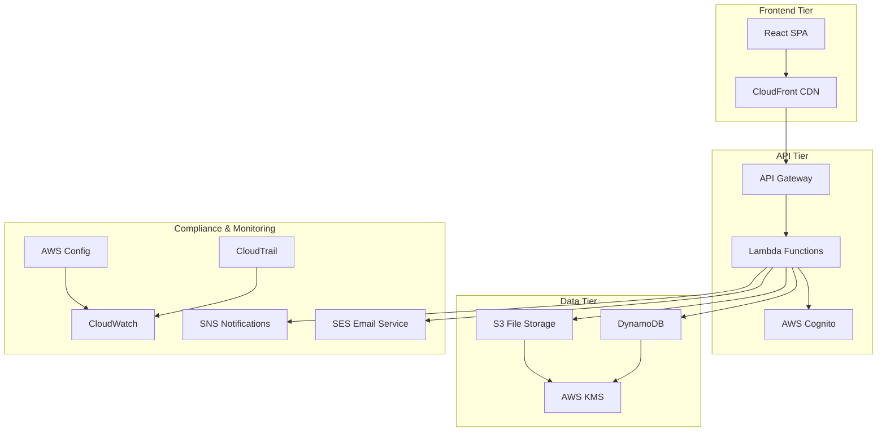

# Design Document

## Overview

The Singapore-compliant file sharing application is designed as a fully serverless, cloud-native solution leveraging AWS free tier services to ensure security, compliance, and cost-effectiveness. The architecture follows a serverless pattern with a React frontend, Lambda functions with API Gateway, and AWS managed services for data storage, authentication, and compliance monitoring.

The system emphasizes security-first design with end-to-end encryption, comprehensive audit logging, and automated compliance monitoring specifically tailored for Singapore's regulatory environment including PDPA (Personal Data Protection Act) requirements.

## Architecture

### High-Level Architecture



### AWS Services Selection (Free Tier Optimized)

**Frontend & Content Delivery:**
- **CloudFront**: Global CDN for React SPA (1TB data transfer/month free)
- **S3 Static Hosting**: Hosts React application (5GB storage free)
- **Route 53**: DNS management (25 hosted zones free for 12 months)

**Compute & API:**
- **API Gateway**: REST API endpoints (1M API calls/month free)
- **Lambda Functions**: Serverless compute (1M requests/month free)
- **Lambda Layers**: Shared dependencies and utilities

**Authentication & Authorization:**
- **AWS Cognito User Pools**: User authentication (50,000 MAUs free)
- **Cognito Identity Pools**: Temporary AWS credentials for frontend
- **IAM Roles**: Fine-grained permissions for all services

**Data Storage:**
- **S3**: Primary file storage with versioning (5GB storage, 20,000 GET requests free)
- **DynamoDB**: Metadata, audit logs, and user data (25GB storage, 25 RCU/WCU free)
- **DynamoDB Streams**: Real-time data change capture

**Security & Encryption:**
- **AWS KMS**: Customer-managed keys (20,000 requests/month free)
- **AWS Certificate Manager**: SSL/TLS certificates (free for AWS resources)
- **AWS WAF**: Web application firewall (1M requests/month free)

**Compliance & Monitoring:**
- **AWS Config**: Compliance rule monitoring (2,000 configuration items free)
- **CloudTrail**: API call logging (one trail free)
- **CloudWatch**: Metrics, logs, and alerting (10 custom metrics, 5GB logs free)
- **SNS**: Real-time notifications (1M publishes/month free)
- **SES**: Email notifications (62,000 emails/month free)

## Components and Interfaces

### Frontend Components (React)

**Authentication Module:**
- `LoginComponent`: Cognito-integrated login interface
- `AuthGuard`: Route protection and session management
- `UserProfile`: User settings and preferences

**File Management Module:**
- `FileUpload`: Drag-and-drop upload with progress tracking
- `FileList`: Display user files with metadata
- `FileShare`: Sharing interface with email input and expiration settings
- `FilePreview`: Secure file preview capabilities

**Compliance Dashboard:**
- `AuditLog`: Searchable audit trail interface
- `ComplianceStatus`: Real-time compliance monitoring
- `NotificationCenter`: SNS and email notification management

### Backend Lambda Functions (Node.js)

**Authentication Functions:**
- `auth-handler`: Handles Cognito authentication flows
- `profile-handler`: User profile management
- `token-refresh`: JWT token refresh logic

**File Management Functions:**
- `file-upload`: Generates S3 presigned URLs for secure uploads
- `file-list`: Retrieves user's files from DynamoDB
- `file-details`: Gets specific file metadata
- `file-delete`: Removes files from S3 and DynamoDB
- `file-share`: Creates secure sharing tokens
- `file-download`: Validates tokens and provides download access

**Notification Functions:**
- `email-notification`: Sends file sharing emails via SES
- `sns-notification`: Publishes download notifications
- `audit-logger`: Processes and stores audit events

**API Gateway Endpoints:**
```
POST /auth/profile
GET  /files
POST /files/upload-url
GET  /files/{id}
DELETE /files/{id}
POST /files/{id}/share
GET  /shared/{token}
GET  /audit/logs
POST /notifications/preferences
```

### DynamoDB Table Design

**Users Table:**
```json
{
  "TableName": "Users",
  "KeySchema": [
    { "AttributeName": "userId", "KeyType": "HASH" }
  ],
  "AttributeDefinitions": [
    { "AttributeName": "userId", "AttributeType": "S" },
    { "AttributeName": "cognitoSub", "AttributeType": "S" }
  ],
  "GlobalSecondaryIndexes": [
    {
      "IndexName": "CognitoSubIndex",
      "KeySchema": [
        { "AttributeName": "cognitoSub", "KeyType": "HASH" }
      ]
    }
  ]
}
```

**Files Table:**
```json
{
  "TableName": "Files",
  "KeySchema": [
    { "AttributeName": "userId", "KeyType": "HASH" },
    { "AttributeName": "fileId", "KeyType": "RANGE" }
  ],
  "AttributeDefinitions": [
    { "AttributeName": "userId", "AttributeType": "S" },
    { "AttributeName": "fileId", "AttributeType": "S" }
  ],
  "StreamSpecification": {
    "StreamEnabled": true,
    "StreamViewType": "NEW_AND_OLD_IMAGES"
  }
}
```

**FileShares Table:**
```json
{
  "TableName": "FileShares",
  "KeySchema": [
    { "AttributeName": "shareToken", "KeyType": "HASH" }
  ],
  "AttributeDefinitions": [
    { "AttributeName": "shareToken", "AttributeType": "S" },
    { "AttributeName": "fileId", "AttributeType": "S" },
    { "AttributeName": "expiresAt", "AttributeType": "N" }
  ],
  "GlobalSecondaryIndexes": [
    {
      "IndexName": "FileIdIndex",
      "KeySchema": [
        { "AttributeName": "fileId", "KeyType": "HASH" }
      ]
    }
  ],
  "TimeToLiveSpecification": {
    "AttributeName": "expiresAt",
    "Enabled": true
  }
}
```

**AuditLogs Table:**
```json
{
  "TableName": "AuditLogs",
  "KeySchema": [
    { "AttributeName": "userId", "KeyType": "HASH" },
    { "AttributeName": "timestamp", "KeyType": "RANGE" }
  ],
  "AttributeDefinitions": [
    { "AttributeName": "userId", "AttributeType": "S" },
    { "AttributeName": "timestamp", "AttributeType": "N" },
    { "AttributeName": "action", "AttributeType": "S" }
  ],
  "GlobalSecondaryIndexes": [
    {
      "IndexName": "ActionIndex",
      "KeySchema": [
        { "AttributeName": "action", "KeyType": "HASH" },
        { "AttributeName": "timestamp", "KeyType": "RANGE" }
      ]
    }
  ]
}
```

## Data Models

### File Model
```typescript
interface File {
  id: string;
  userId: string;
  s3Key: string;
  originalName: string;
  fileSize: number;
  contentType: string;
  encryptionKeyId: string;
  createdAt: Date;
  updatedAt: Date;
}
```

### FileShare Model
```typescript
interface FileShare {
  id: string;
  fileId: string;
  sharedBy: string;
  shareToken: string;
  recipientEmail: string;
  expiresAt: Date;
  downloadCount: number;
  maxDownloads?: number;
  createdAt: Date;
}
```

### AuditLog Model
```typescript
interface AuditLog {
  id: string;
  userId: string;
  action: string;
  resourceType: string;
  resourceId: string;
  ipAddress: string;
  userAgent: string;
  metadata: Record<string, any>;
  createdAt: Date;
}
```

## Error Handling

### Frontend Error Handling
- **Network Errors**: Retry mechanism with exponential backoff
- **Authentication Errors**: Automatic token refresh and re-login prompts
- **File Upload Errors**: Chunked upload with resume capability
- **User-Friendly Messages**: Translated error messages for common scenarios

### Backend Error Handling
- **Validation Errors**: Joi schema validation with detailed error responses
- **Database Errors**: Connection pooling and transaction rollback
- **AWS Service Errors**: Retry logic with circuit breaker pattern
- **Security Errors**: Rate limiting and suspicious activity detection

### Error Response Format
```typescript
interface ErrorResponse {
  error: {
    code: string;
    message: string;
    details?: Record<string, any>;
    timestamp: string;
    requestId: string;
  };
}
```

## Testing Strategy

### Unit Testing
- **Frontend**: Jest and React Testing Library for component testing
- **Backend**: Jest with supertest for API endpoint testing
- **Database**: In-memory PostgreSQL for isolated database testing
- **AWS Services**: AWS SDK mocking with aws-sdk-mock

### Integration Testing
- **API Integration**: Full request/response cycle testing
- **Database Integration**: Real database connections with test data
- **AWS Integration**: LocalStack for local AWS service simulation
- **Authentication Flow**: End-to-end Cognito integration testing

### End-to-End Testing
- **Cypress**: Full user journey testing including file upload/download
- **Security Testing**: OWASP ZAP integration for vulnerability scanning
- **Performance Testing**: Artillery.js for load testing
- **Compliance Testing**: Automated checks for Singapore regulatory requirements

### Compliance Testing Framework
- **PDPA Compliance**: Automated tests for data protection requirements
- **Audit Trail Verification**: Tests ensuring all actions are logged
- **Encryption Validation**: Tests verifying end-to-end encryption
- **Access Control Testing**: Permission and authorization validation

### Infrastructure Testing
- **Terraform Validation**: terraform plan and validate in CI/CD
- **AWS Config Rules**: Automated compliance rule testing
- **Security Group Testing**: Network access validation
- **Backup and Recovery**: Disaster recovery procedure testing

## Singapore Compliance Considerations

### Personal Data Protection Act (PDPA) Compliance
- **Data Minimization**: Only collect necessary user data
- **Consent Management**: Clear consent mechanisms for data processing
- **Data Retention**: Automated data lifecycle management
- **Right to Access**: User data export functionality
- **Right to Deletion**: Secure data deletion with audit trail

### Security Standards
- **Encryption**: AES-256 encryption for data at rest and TLS 1.3 for data in transit
- **Key Management**: Customer-managed KMS keys with automatic rotation
- **Access Logging**: Comprehensive audit trail for all data access
- **Network Security**: VPC with private subnets and security groups

### Monitoring and Alerting
- **Real-time Monitoring**: CloudWatch dashboards for system health
- **Compliance Alerts**: Automated notifications for compliance violations
- **Security Incidents**: Integration with AWS Security Hub
- **Performance Monitoring**: Application and infrastructure metrics