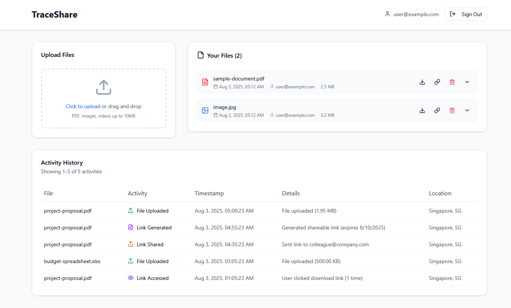
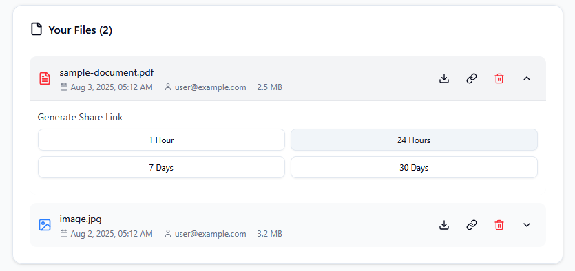
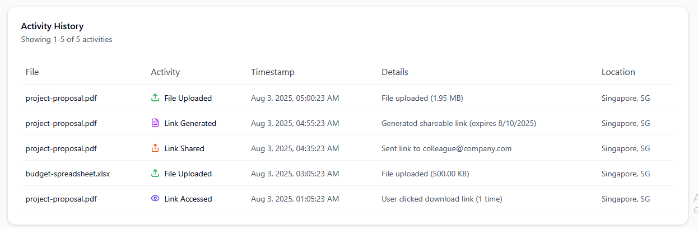

# TraceShare - Secure File Sharing Application

**A personal security learning project where I'm building a serverless, cloud-native internal file sharing tool for companies using AWS. The focus is on quick, secure file sharing through custom links that expire with complete audit trails and visibility for every action.**

Note: This project is still in progress.

## What TraceShare Offers

**⚡ Lightning Fast** - Log in, upload a file, and generate a custom link to share within seconds  
**🔒 Secure File Sharing** - Secure uploads/downloads using presigned URLs with restricted access  
**📊 Complete Audit Trails** - Every upload, download, and share is tracked with timestamp and location  
**🛡️ Security & Privacy** - Authentication with MFA, encryption at rest and in transit, all data in Singapore (ap-southeast-1)  
**☁️ Serverless Architecture** - Built on AWS Lambda, API Gateway and other AWS services for automatic scaling and cost efficiency  

## Screenshots

### Main Dashboard

*Clean, intuitive interface showing file uploads, list management, and real-time activity tracking*

### File Management & Link Generation

*Easy file management with secure link generation and customizable expiry times*

### Activity Monitoring

*Comprehensive audit trails showing all file activities with location and timestamp data*

---

## Project Motivation
As a fresh graduate looking to deepen my understanding of cloud security, I wanted to build something that would challenge me to implement:
- **Authentication & Authorization** patterns in the cloud
- **Data encryption** both in transit and at rest
- **Secure file handling** with proper access controls
- **Audit logging** for security monitoring
- **Infrastructure as Code** for reproducible deployments
- **Basic compliance considerations** under Singapore's context

## Architecture

**Serverless & Cloud-Native Design:**
- **Frontend**: React SPA with TypeScript
- **Backend**: Node.js Lambda functions with API Gateway
- **Database**: DynamoDB foraudit logging
- **Storage**: S3 with KMS encryption and lifecycle policies
- **Authentication**: AWS Cognito with MFA
- **Notifications (Planned)** : SES for email sharing, SNS for download alerts
- **Compliance (Planned)**: AWS Config rules for automated compliance scoring
- **Infrastructure (Planned)**: 100% Terraform-managed infrastructure as code

## Learning Goals & Development Methodology

### My Development Approach
1. **Spec-Driven Development**: Using Kiro AI to generate detailed requirements and act as my project manager
2. **Console-First Implementation**: Building and testing features manually to make sure I understand what I am building
3. **Infrastructure as Code**: Writing Terraform to codify and automate the manual configurations after that
4. **Iterative Security Hardening**: Starting with basic functionality, then layering in security controls

### Security Concepts I'm Exploring
- **Authentication & Authorization**: AWS Cognito integration with JWT tokens
- **Data Encryption**: Learning KMS for encryption at rest and TLS for transit
- **Access Controls**: Implementing least-privilege IAM policies and presigned URLs
- **Audit Logging**: Building comprehensive logging for security monitoring
- **Secure File Handling**: Understanding secure upload/download patterns

### Compliance Learning (Singapore Focus)
- **PDPA Basics**: Understanding Personal Data Protection Act requirements
- **Data Residency**: Keeping data within Singapore region (ap-southeast-1)
- **Audit Trails**: Learning what needs to be logged for compliance
- **User Rights**: Implementing basic data access and deletion capabilities

## What I'm Building

### Core Features (Learning Focus)
- **File Upload/Download**: Practicing secure file handling with S3 presigned URLs
- **User Authentication**: Implementing AWS Cognito for login/signup flows
- **Access Controls**: Learning to implement proper file permissions
- **Audit Logging**: Building comprehensive activity tracking

## Tech Stack (What I'm Learning With)

### Frontend
- **React 18** with TypeScript (getting comfortable with modern React)
- **Tailwind CSS** for styling (learning utility-first CSS)
- **AWS Cognito SDK** for authentication (no Amplify - doing it manually to learn)
- **Vite** for build tooling

### Backend (In Progress)
- **Node.js 22** Lambda functions 
- **API Gateway** REST API (learning API design)
- **DynamoDB** with streams (NoSQL database practice)
- **S3** with presigned URLs (secure file handling)

### Infrastructure
- **Terraform** for infrastructure as code (learning IaC principles)
- **AWS Provider** with Singapore region
- **Modular approach** (trying to write reusable code)

## What I Want to Learn About Monitoring

Future learning goals for observability:
- **CloudWatch Basics**: Understanding logs and basic metrics
- **Simple Dashboards**: Creating basic monitoring views
- **Alerting**: Setting up notifications for errors
- **Cost Monitoring**: Keeping track of AWS spending
- **Security Monitoring**: Learning what security events to watch for
